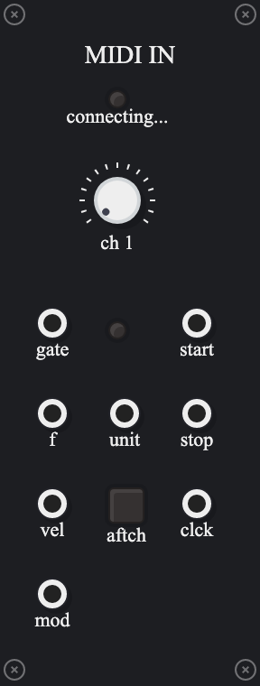

# patchcab-modules

Some modules for [Patchcab](https://github.com/spectrome/patchcab/).

Requiements:
- A working installation of Patchab. [See its github page for details](https://github.com/spectrome/patchcab/).
- For the Midi In module, you'll need some kind of midi controller visible to the [Web Midi API](https://developer.mozilla.org/en-US/docs/Web/API/MIDIAccess).

To install any of these modules individually on top of your Patchcab project, run e.g.

```
yarn install @banksean/patchcab-additiveosc
yarn install @banksean/patchcab-cvsequencer
yarn install @banksean/patchcab-midiin
yarn install @banksean/patchcab-polyrhythm
```

from your patchcab project directory (...and probably rebuild/restart the server etc).

# Modules in this repo

## CVSequencer
- [source](packages/cvsequencer)
- @banksean/patchcab-cvsequencer


- 4 step "cv" sequencer
- steps have knobs to set values in [0, 1]
- advance and reset gate inputs

## AdditiveOSC
- [source](packages/additiveosc)
- @banksean/patchcab-additiveosc


- raw frequency value input for the fundamental (see development notes/caveats below, re: "voltage" convetions)
- faders to control each of the first 16 harmonic overtones of the fundamental frequency

## MIDIIn
- [source](packages/midiin)
- @banksean/patchcab-midiin



- gate, pitch, velocity and mod
- monophonic, so only one note/velocity/mod etc at a time.
- selectable midi channel 1-16
- toggle for aftertouch velocity
- transport outputs: start, stop and clock (MIDI is 24ppq so you may want a divider)
- note output is raw frequency value, in 12 tone equal temperment (see development notes/caveats below, re: "voltage" convetions).

## Polyrhythm
- [source](packages/polyrhythm)
- @banksean/patchcab-polyrhythm


- gate sequencer inspired by the sequencer section of the [Moog Subharmonicon](https://www.moogmusic.com/products/subharmonicon)
- "divider" knobs control the value of each of four distinct clock dividers
  - discrete values the rage 1-16
  - produces an output clock pulse at the rising edge of every N input clock pulses
- "offset" knobs control the offset (or phase) of each of the four clock dividers
  - will produce an output clock pulse at the rising edge of every N clock pulses, offset by this value of clock pulses.
- two trigger/gate outputs
- each rhythm/offset pair can be assigned to any combination of the two trigger outputs by activating the switch located at the output's row and rhythm/offset pair's column

Familiarity with the actual Subharmonicon is very helpful here, as it's beyond the scope of this README, but some things to note:
- The physical Subharmonicon device allows you to create rhythm offsets by quickly turning the division knobs between clock pulses while it's running.
- If you power cycle the device or reset the sequencer, these offsets disappear. So the pattern generator has internal state not accessible directly from the controls on the front panel. And it goes "poof" way too easily.
- This quirk of the physical Subharmonicon has driven me nuts, and I wrote this module with Offset knobs specifically to demonstrate one possible way to address it.

# Development

## Package and Publish

I use [lerna](https://github.com/lerna/lerna#readme) to manage separate npm packages for each module in this repo.

## Build
```
lerna run build
```

or cd into indivudal packages/ directories and run `yarn build` from there.

## UI Framework

Patchcab uses [Svelte](https://svelte.dev/), a UI framework I'd never used before this. I'm more of a Web Components, [a la carte web development](https://bitworking.org/news/2018/03/a-la-carte-web-development/) fan myself, but Svelte seems fine for this purpose and the Patchcab source has lots of examples to learn from.

### @banksean/patchcab-ui

`packages/ui` contains some UI widgets I needed to make these modules: an indicator light for "midi connected" or faders for the Additive Oscillator etc. I wouldn't recommend using this package outside of this repository though.

## Voltage, pitch signals etc (Hz, not "Volts")

For both the Midi In module and the Additive Oscillator, I wrote the inputs/outputs to assume Hz rather than an intermediate "voltage" that then gets rescaled into/out of Hz.

I'm not wedded to this decision, and may change it later if I find enough use cases where I want to modulate pitch using some other unit besides Hz.

Patchcab doesn't (AFAICT) specify any conventions for value ranges on things like "pitch" signals. In pysicaly Eurorack of course, there is the 1V/Octave standard. Here, we have ... Javascript [Number](https://developer.mozilla.org/en-US/docs/Web/JavaScript/Reference/Global_Objects/Number) types.

VCVRack (which inspired Patchcab) has some [documented voltage standards for its modules](https://vcvrack.com/manual/VoltageStandards), but I'm not sure yet how useful they'd be for Patchab.
