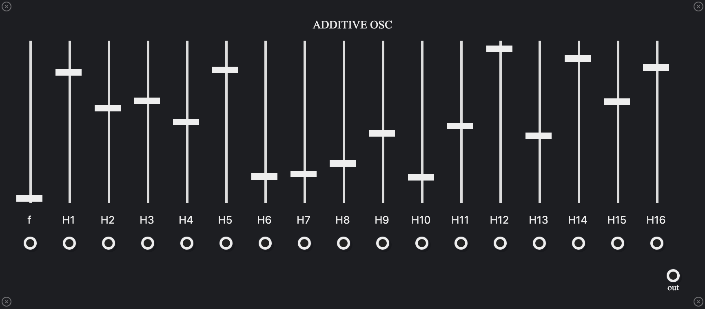

# patchcab-modules

Modules for [patchcab](https://github.com/spectrome/patchcab/).

# CVSequencer

- 4 step "cv" sequencer
- steps have knobs to set values in [0, 1]
- advance and reset gate inputs

# AdditiveOSC

- raw frequency value input for the fundamental
- faders to control each of the first 16 harmonic overtones of the fundamental

# MIDIIn

- monophonic
- selectable midi channel
- note output is raw frequency value (12 tone equal temperment)

# Polyrhythm

- gate sequencer inspired by the sequencer section of the Moog Subharmonicon
- "rhythm" knobs control the rate of each of four distinct clock dividers
- "offset" knobs control the offset (phase) of each of the four clock dividers
- two trigger/gate outputs
- each rhythm/offset pair can be assigned to any combination of the two trigger outputs by activating the switch located at the output's row and rhythm/offset pair's column
